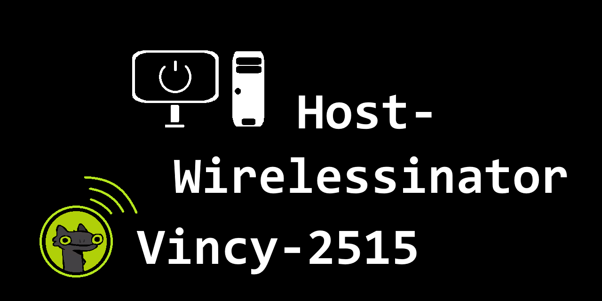
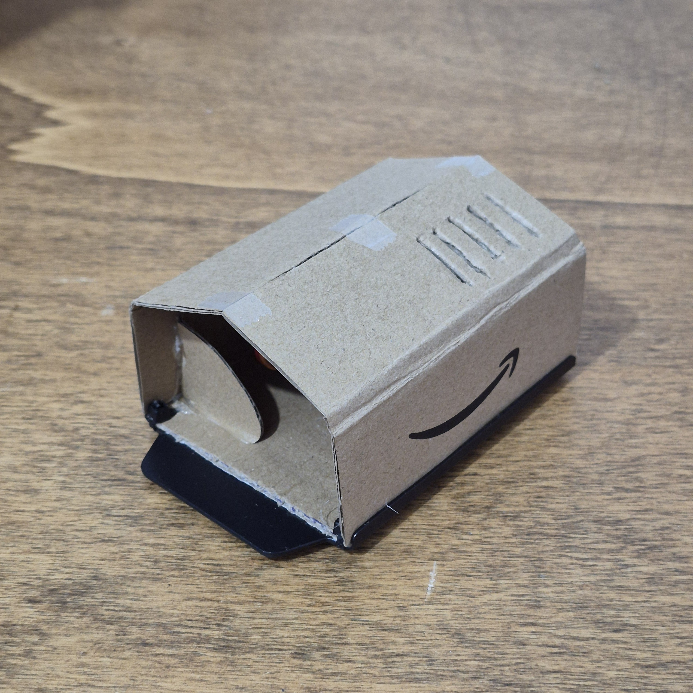
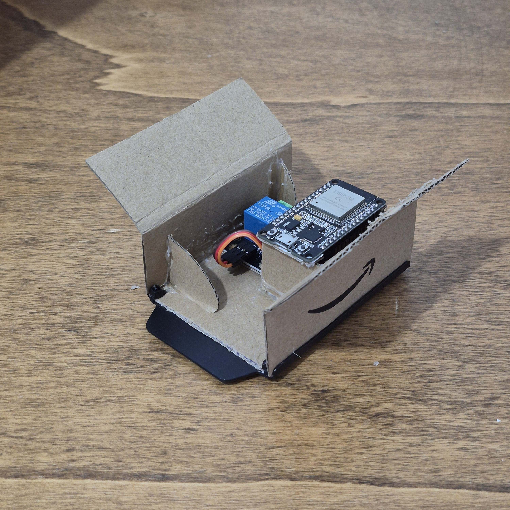

## Cos'è?
Host-Wirelessinator è un piccolo progetto che ho creato per permettermi di accendere il mio PC in remoto.

Questo progetto contiene il codice in C++ eseguito dal mio ESP32 collegato tramite relay ai pin del "POWER SWITCH" del PC, e il codice in HTML, CSS e TypeScript per potermi interfacciare con l'ESP32 dal browser.

## L'ESP32
La scheda è una ESP32-DevKit-V1 su cui ho collegato un relay per permettermi di chiudere il circuito del "POWER SWITCH" del mio PC in sicurezza.

|                                                                |                                                                |
| -------------------------------------------------------------- | -------------------------------------------------------------- |
|  |  |

Il codice dell'ESP32 è scritto per supportare la gestione (avvio) di più host, che essi siano collegati tramite relay o semplicemente sulla stessa rete e con il WakeOnLAN abilitato. Tutto è specificato all'interno di una stringa JSON simile a questa:

```json
{
    "number_of_hosts": 2,
    "0": {
        "name": "PC-NAME",
        "type": "Personal Computer",
        "control_options": {
            "use_relay": true,
            "relay_pin": 15,
            "use_magic_packet": false,
            "mac_address": ""
        }
    },
    "1": {
        "name": "Server-NAME",
        "type": "Server",
        "control_options": {
            "use_relay": false,
            "relay_pin": -1,
            "use_magic_packet": true,
            "mac_address": "00:00:00:00:00:00"
        }
    }
}
```

L'ESP32 rimane costantemente in ascolto di richieste sulla rete locale e alla ricezione del comando corretto effettua l'azione desiderata, di seguito la lista dei comandi che ho implementato:
- `GetHostsJson`: questo è il comando che l'interfaccia Web invia per primo in assoluto, permette all'interfaccia di ottenere una stringa JSON contenente gli host che è possibile comandare tramite l'ESP32, oltre ad altre informazioni sugli host stessi 
- `Boot <nome_host>`: questo comando, specificando il nome dell'host interessato, permette di accendere l'host tramite il relay o "magic packet" via rete in base a come specificato nella stringa JSON

## L'interfaccia

<p align="center"> 
    
</p>

L'interfaccia è suddivisa in tre parti principali:
- la prima è relativa all'ESP32 qui si può controllare lo stato di connessione all'ESP32 e eventualmente decidere se alla connessione successiva mantenere il browser e l'ESP32 connessi;
- la seconda parte è quella dove vengono mostrati gli host che è possibile avviare o arrestare, popolata solo dopo l'ottenimento della stringa JSON dall'ESP32;
- la terza parte riguarda la piccola "console" se così si può chiamare, messa in sovrapposizione al resto, che ho aggiunto semplicemente per scopi di debug. Permette l'invio di comandi all'ESP32 e la visualizzazione delle risposte ricevute da esso, oltre ad altre informazioni utili.

## La comunicazione tra browser e ESP32

Per semplificarmi il lavoro ho stabilito un piccolo protocollo di comunicazione tra browser e ESP32 che semplicemente permette all'interfaccia di specificare all'ESP32 se mantenere la connessione attiva o meno, oltre che l'invio di un determinato comando.

Questa è la struttura generale di questo mini protocollo di comunicazione: 

```
Header:     |Connection:[keep_connection, close_connection]\n
            |-- HEADER END --\n
Command:    |{a command from the commandlist}
```

## Uso remoto e hosting dell'interfaccia web

In quanto lo scopo iniziale di questo progetto era creare un qualcosa che mi permettesse di accendere il mio PC anche in remoto, e quindi fuori dalla mia rete locale, ho configurato sul mio router una VPN a cui posso accedere in qualsiasi momento dal mio cellulare. Questo oltre al servizio di Dynamic DNS che ho sfruttato per ottenere un indirizzo sempre valido al mio router di casa.

Per quanto riguarda la pagina Web ho deciso di ospitarla in modo locale direttamente sul mio cellulare utilizzando Termux e il server HTTP nativo di Python.

